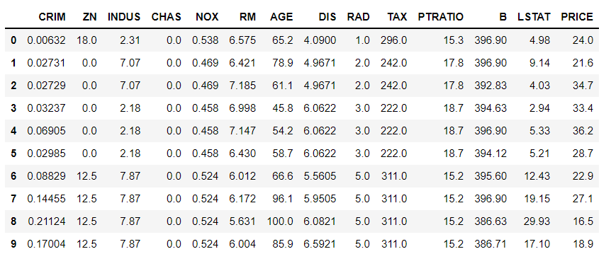
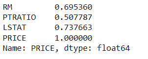
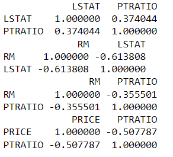

# Ex-07-Feature-Selection
## AIM
To Perform the various feature selection techniques on a dataset and save the data to a file. 

# Explanation
Feature selection is to find the best set of features that allows one to build useful models.
Selecting the best features helps the model to perform well. 

# ALGORITHM
### STEP 1
Read the given Data
### STEP 2
Clean the Data Set using Data Cleaning Process
### STEP 3
Apply Feature selection techniques to all the features of the data set
### STEP 4
Save the data to the file

# CODE
~~~
Program developed by: K.Balaji
Register number: 212221230011

from sklearn.datasets import load_boston
import pandas as pd
import numpy as np
import matplotlib
import matplotlib.pyplot as plt
import seaborn as sns
import statsmodels.api as sm
%matplotlib inline
from sklearn.model_selection import train_test_split
from sklearn.linear_model import LinearRegression
from sklearn.feature_selection import RFE
from sklearn.linear_model import RidgeCV, LassoCV, Ridge, Lasso

x = load_boston()
df = pd.DataFrame(x.data, columns = x.feature_names)
df["PRICE"] = x.target
X = df.drop("PRICE",1) 
y = df["PRICE"]          
df.head(10)

plt.figure(figsize=(12,10))
cor = df.corr()
sns.heatmap(cor, annot=True, cmap=plt.cm.Reds)
plt.show()

cor_target = abs(cor["PRICE"])
relevant_features = cor_target[cor_target>0.5]
relevant_features

print(df[["LSTAT","PTRATIO"]].corr())
print(df[["RM","LSTAT"]].corr())
print(df[["RM","PTRATIO"]].corr())
print(df[["PRICE","PTRATIO"]].corr())

X_1 = sm.add_constant(X)
model = sm.OLS(y,X_1).fit()
model.pvalues

#Backward Elimination
cols = list(X.columns)
pmax = 1
while (len(cols)>0):
    p= []
    X_1 = X[cols]
    X_1 = sm.add_constant(X_1)
    model = sm.OLS(y,X_1).fit()
    p = pd.Series(model.pvalues.values[1:],index = cols)      
    pmax = max(p)
    feature_with_p_max = p.idxmax()
    if(pmax>0.05):
        cols.remove(feature_with_p_max)
    else:
        break
selected_features_BE = cols
print(selected_features_BE)

model = LinearRegression()
#Initializing RFE model
rfe = RFE(model, 7)
#Transforming data using RFE
X_rfe = rfe.fit_transform(X,y)  
#Fitting the data to model
model.fit(X_rfe,y)
print(rfe.support_)
print(rfe.ranking_)

nof_list=np.arange(1,13)            
high_score=0
nof=0           
score_list =[]
for n in range(len(nof_list)):
    X_train, X_test, y_train, y_test = train_test_split(X,y, test_size = 0.3, random_state = 0)
    model = LinearRegression()
    rfe = RFE(model,nof_list[n])
    X_train_rfe = rfe.fit_transform(X_train,y_train)
    X_test_rfe = rfe.transform(X_test)
    model.fit(X_train_rfe,y_train)
    score = model.score(X_test_rfe,y_test)
    score_list.append(score)
    if(score>high_score):
        high_score = score
        nof = nof_list[n]
print("Optimum number of features: %d" %nof)
print("Score with %d features: %f" % (nof, high_score))

cols = list(X.columns)
model = LinearRegression()
rfe = RFE(model, 10)             
X_rfe = rfe.fit_transform(X,y)  
model.fit(X_rfe,y)              
temp = pd.Series(rfe.support_,index = cols)
selected_features_rfe = temp[temp==True].index
print(selected_features_rfe)

#3. Embedded Method
reg = LassoCV()
reg.fit(X, y)
print("Best alpha using built-in LassoCV: %f" % reg.alpha_)
print("Best score using built-in LassoCV: %f" %reg.score(X,y))
coef = pd.Series(reg.coef_, index = X.columns)

print("Lasso picked " + str(sum(coef != 0)) + " variables and eliminated the other " +  str(sum(coef == 0)) + " variables")
imp_coef = coef.sort_values()
import matplotlib
matplotlib.rcParams['figure.figsize'] = (8.0, 10.0)
imp_coef.plot(kind = "barh")
plt.title("Feature importance using Lasso Model")
~~~
# OUTPUT
## DATASET

## HEATMAP

## HIGHLY CORRELATED FEATURE WITH OUTPUT VARIABLE PRICE

## CHECKING CORRELATION WITH EACH OTHER:

## BACKWARD ELIMINATION:

## RECURSIVE FEATURE ELIMINATION(RFE)

## NUMBER OF FEATURE HAVING HIGH ACCURACY

## FINAL SET OF FEATURE

## EMBEDDED METHOD

# RESULT
Thus various feature selection techniques have been performed on a given dataset successfully.